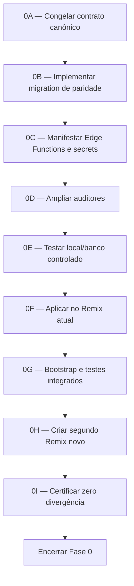

# Plano da Fase 0 — Certificação integral de um Remix White Label

**Data:** 14/08/2026

**Status:** implementação local do contrato `20260814.1` concluída; rollout controlado pendente

**Produção alterada:** não

**Remixes alterados:** não

**Objetivo do gate:** provar que um Remix novo recebe o mesmo contrato de plataforma da produção, sem copiar dados operacionais nem secrets

> Atualização de execução: os artefatos implementados e a ordem atual dos gates
> estão em `docs/perf/FASE-0-CERTIFICACAO-RUNTIME-REMIX.md`. Este documento
> permanece como especificação integral e histórico de decisão.

## 1. Resultado esperado

Um Remix só será certificado quando reproduzir, a partir do Git e de um procedimento determinístico:

- schema lógico;
- extensões requeridas;
- tipos, tabelas, colunas e defaults;
- constraints e índices;
- views, funções e triggers;
- RLS e policies;
- ACLs de schema, tabelas, sequências e funções;
- atributos de segurança das funções;
- publications Realtime e `REPLICA IDENTITY` necessárias;
- buckets e policies de Storage;
- dados globais de referência;
- Edge Functions e suas configurações de JWT/import map;
- nomes de secrets obrigatórios e opcionais, sem copiar valores;
- configurações de Auth/OAuth/domínios que não cabem em migration;
- crons, workers e configuração runtime do próprio projeto;
- commit, versão do contrato e evidência de certificação.

O resultado não será declarado por quantidade aproximada. Cada domínio terá uma lista canônica, fingerprint ou teste comportamental e deverá produzir zero divergência bloqueante.

## 2. Definição de “100% igual”

### 2.1 Deve ser igual

“100% igual” significa equivalência do contrato funcional e de segurança da plataforma:

1. todos os objetos versionáveis necessários existem;
2. as definições lógicas são equivalentes;
3. nenhum papel possui privilégio acima ou abaixo do contrato;
4. RLS e policies produzem o mesmo isolamento;
5. as mesmas tabelas aprovadas participam do Realtime;
6. as mesmas Edge Functions versionadas estão publicadas com a mesma política de JWT;
7. os mesmos nomes obrigatórios de secrets estão presentes;
8. jobs usam URL/chaves do próprio ambiente;
9. dados globais de referência são equivalentes;
10. o aplicativo passa pelos mesmos testes funcionais.

### 2.2 Deve ser diferente por ambiente

Os seguintes valores não podem ser copiados da produção:

- project ref e URL do Supabase;
- anon/publishable key e service role key;
- worker secret;
- tokens de integrações;
- secrets de webhooks;
- credenciais OAuth;
- domínios e callbacks específicos do cliente;
- usuários, organizações, perfis e papéis operacionais;
- leads, mensagens, tickets, campanhas, pedidos e mídias;
- credenciais e tokens armazenados por tenant;
- logs, filas, locks, métricas e histórico operacional;
- partições internas gerenciadas pelo Supabase;
- versões de patch de extensões gerenciadas quando a versão do Remix é compatível ou superior.

Paridade de secrets significa paridade de **nomes, classificação e presença esperada**, nunca igualdade de valor.

O ledger também não deve ser falsificado. Não serão inseridas manualmente as 259 versões de produção em `supabase_migrations.schema_migrations`. O ledger do Remix deve registrar somente migrations realmente executadas naquele projeto. A equivalência será comprovada por fingerprints e por uma versão explícita do contrato de plataforma criada pela migration pós-Remix.

## 3. Evidência já coletada

### 3.1 Produção

- 253 tabelas base em `public`;
- 262 relações públicas comparadas;
- 351 rotinas públicas;
- 3.969 colunas;
- 581 policies;
- 824 índices;
- 259 migrations registradas;
- 17 buckets de Storage;
- sete tabelas públicas na publication `supabase_realtime`.

### 3.2 Remix atual de 14/08

- schema lógico equivalente à produção;
- zero função, tabela ou relação ausente;
- fingerprints iguais para funções, constraints, índices, policies, triggers, relações, views e tipos;
- colunas logicamente equivalentes por nome, tipo, nulabilidade, default e geração;
- 17 buckets equivalentes;
- 57 funções com ACL/security divergente;
- 11 relações com ACL divergente;
- zero tabela pública na publication Realtime;
- ledger `supabase_migrations` ausente;
- zero cron e zero configuração runtime antes do primeiro acesso;
- zero dado operacional herdado.

### 3.3 Remixes históricos

Os Remixes de 03/08 e 07/08 possuem somente uma migration registrada e também perderam ACLs de funções existentes antes de sua criação. Nenhum possui tabelas públicas na publication Realtime. Isso comprova que a perda não foi causada pelos secrets ignorados ou somente pelas migrations de 13/08.

## 4. Causa raiz

O fluxo de Remix materializa grande parte do estado estrutural, mas não reproduz todos os efeitos de migrations:

- não preserva o ledger completo;
- não preserva todos os `REVOKE`/`GRANT`;
- não preserva a membership da publication Realtime;
- não inicializa dados/configuração runtime que dependem do projeto novo;
- não fornece evidência suficiente de deployment das Edge Functions.

O auditor existente, `scripts/audit-remix-database.mjs`, valida arquivos SQL no repositório. Ele não consulta o banco materializado e ignora explicitamente o audit quando os diretórios de migrations não estão presentes. Portanto, um build verde não prova paridade efetiva do banco.

A documentação de Edge Functions também está desatualizada: o repositório possui 217 diretórios publicáveis com `index.ts`, enquanto `docs/EDGE_FUNCTIONS.md` declara 81.

## 5. Princípios da solução

1. Git continua sendo a fonte de verdade.
2. Produção é evidência do estado atual, não gerador automático de SQL.
3. Nenhum dump completo de produção será restaurado em Remix.
4. Nenhum dado de tenant será usado para obter paridade.
5. Toda mudança de banco será migration incremental.
6. Migrations aplicadas nunca serão editadas ou removidas.
7. O executor autorizado da Lovable aplicará migrations; o agente não aplicará SQL.
8. Edge Functions serão publicadas a partir do Git, nunca copiadas de um bundle desconhecido.
9. Secrets serão configurados manualmente por nome e proprietário.
10. A certificação combinará audit estático, inspeção read-only e testes comportamentais.
11. O Remix atual será corrigido, mas um Remix novo adicional será necessário para comprovar repetibilidade.

## 6. Arquitetura do contrato de paridade

O programa deverá criar quatro artefatos versionados.

### 6.1 Manifesto canônico

Arquivo sugerido: `supabase/remix-contract.json`.

Deverá registrar, sem secrets:

- versão do contrato;
- migrations/baselines obrigatórias;
- funções críticas e ACL por assinatura completa;
- tabelas internas e ACL por papel;
- funções `SECURITY DEFINER` e `search_path` esperado;
- lista aprovada do Realtime;
- buckets e configuração;
- tabelas de referência e chave natural;
- lista das 217 Edge Functions;
- `verify_jwt`, entrypoint e import map de cada Function;
- secrets requeridos/opcionais por Function;
- crons esperados após bootstrap;
- configurações externas exigidas;
- itens explicitamente gerenciados pelo Supabase e não comparáveis byte a byte.

O manifesto não deve conter hashes ou valores de credenciais.

### 6.2 Migration pós-Remix

Arquivo futuro: nova migration timestampada em `supabase/migrations/`.

Responsabilidades:

- reconciliar as 57 ACLs de funções por assinatura completa;
- reconciliar as 11 ACLs de relações;
- preservar grants legítimos de `anon` e `authenticated`;
- restringir funções internas a `service_role` quando esse for o contrato;
- validar `SECURITY DEFINER` e `search_path` fixo nas funções críticas;
- configurar defaults seguros para novos objetos, com revisão para os owners `postgres` e `supabase_admin`;
- reconciliar idempotentemente a lista final aprovada do `supabase_realtime`;
- validar `REPLICA IDENTITY` das tabelas que realmente precisam de DELETE/UPDATE completos;
- incluir pré-check e pós-check;
- não copiar dados operacionais;
- não gravar URL, key ou secret da produção;
- falhar de forma transacional se uma assinatura crítica esperada estiver ausente.

Não se deve simplesmente revogar tudo. Cada assinatura precisa ser classificada como:

- interna/service role;
- autenticada;
- pública intencional;
- trigger interna sem chamada por API;
- compatibilidade legada temporária.

### 6.3 Auditores

#### Auditor estático

Evolução de `scripts/audit-remix-database.mjs`:

- não considerar apenas presença de `CREATE FUNCTION`;
- exigir `REVOKE`/`GRANT` explícito para funções críticas;
- exigir `SECURITY DEFINER` e `search_path` quando aplicável;
- conferir o manifesto de Realtime;
- conferir buckets/seeds versionados;
- conferir que toda pasta de Edge Function aparece no manifesto;
- conferir que toda Function pública possui `verify_jwt = false` explícito e guard interno documentado;
- conferir que Functions não públicas usem o default `verify_jwt = true` ou configuração explícita;
- falhar se a documentação e o inventário divergirem.

#### Verificador runtime read-only

Arquivo sugerido: `scripts/verify-remix-runtime.mjs`.

Deverá produzir JSON sanitizado com:

- contagens e fingerprints estruturais;
- objetos ausentes/extras;
- ACLs divergentes;
- RLS/policies divergentes;
- publication e replica identity;
- buckets/policies;
- crons por nome/schedule/active, sem retornar comandos que contenham keys;
- booleanos de URL local e presença de secrets runtime, sem valores;
- contagens de dados operacionais proibidos;
- versão do contrato aplicada.

O script deve ser somente leitura. Não poderá chamar RPCs com side effects.

### 6.4 Checklist de bootstrap

Arquivo sugerido: `docs/REMIX-BOOTSTRAP-CHECKLIST.md`.

Deverá separar:

- automático pelo Supabase;
- aplicado por migration;
- publicado como Edge Function;
- configurado manualmente no painel;
- configurado pelo primeiro super admin;
- opcional por integração;
- proibido copiar da produção.

## 7. Matriz de certificação

| Domínio | Fonte canônica | Validação | Aceite |
|---|---|---|---|
| commit/frontend | Git | SHA e build | commit aprovado e build verde |
| extensions | migration + plataforma | nome/schema/compatibilidade | nenhuma extensão obrigatória ausente |
| tipos | migration | fingerprint | zero diferença |
| tabelas/colunas/defaults | migration | inventário lógico | zero diferença |
| constraints | migration | fingerprint | zero diferença |
| índices | migration | definição normalizada | zero diferença |
| views | migration | definição normalizada | zero diferença |
| funções | migration | assinatura + hash lógico | zero diferença |
| segurança das funções | manifesto/migration | owner, definer, search_path, grants | zero grant excedente/ausente |
| triggers | migration | definição normalizada | zero diferença |
| RLS | migration | flags + policies | zero diferença e testes cross-tenant verdes |
| ACL de relações | manifesto/migration | grants efetivos | zero diferença |
| default privileges | migration | `pg_default_acl` | defaults aprovados |
| Realtime | manifesto/migration | publication + consumidores | lista exata aprovada |
| replica identity | migration | catálogo | valor aprovado por tabela |
| Storage | migration/seed | bucket metadata + policies | zero diferença |
| referência global | migration/seed | hash por chave natural | zero diferença |
| dados operacionais | não copiar | contagens | zero no Remix limpo |
| Edge Functions | Git/config | lista remota + manifesto | conjuntos idênticos |
| JWT das Functions | `config.toml` | metadata remota + testes HTTP | política idêntica |
| secrets | checklist | nomes/presença | obrigatórios presentes, valores não comparados |
| Auth/OAuth | checklist/painel | export sanitizado | configuração aprovada |
| crons | bootstrap/migration | nome/schedule/active | conjunto exato, sem URL externa |
| runtime config | bootstrap | booleanos sanitizados | aponta para o próprio Remix |
| integrações externas | checklist | smoke test controlado | somente integrações habilitadas |

## 8. Fases de execução

### 8.1 Fase 0A — Congelar o contrato canônico

Atividades:

1. mapear as 57 funções divergentes e seus consumidores;
2. classificar cada papel autorizado;
3. revisar as 11 relações divergentes;
4. extrair subscriptions `postgres_changes` do frontend;
5. reconciliar a lista do Git com as sete tabelas Realtime atuais da produção;
6. decidir a lista final com base em consumidores, segurança e custo;
7. classificar seeds globais e dados operacionais;
8. gerar inventário das 217 Edge Functions;
9. classificar 23 nomes de variáveis de ambiente detectados diretamente no código;
10. revisar Functions públicas e guards internos.

Entregável: manifesto revisado, sem alteração de banco.

Gate: responsável técnico aprova explicitamente cada ACL pública e a lista Realtime.

Lista observada atualmente em produção, ainda sujeita à revisão de consumidores:

- `call_events`;
- `call_logs`;
- `campaign_targets`;
- `campaigns`;
- `mia_actions`;
- `support_messages`;
- `support_tickets`.

O baseline histórico `00000000000006_rls_policies.sql` contém uma lista maior e diferente. A migration nova não copiará cegamente nenhuma das duas listas: primeiro será produzido o conjunto final a partir dos consumidores atuais, remoções incrementais já versionadas e custo de Realtime.

### 8.2 Fase 0B — Migration de paridade

Atividades:

1. criar migration incremental;
2. criar pré-checks de existência/assinatura;
3. aplicar grants/revokes mínimos;
4. definir defaults seguros;
5. reconciliar publication;
6. preservar extensões gerenciadas;
7. adicionar versão do contrato de forma não sensível;
8. preparar rollback compensatório em `supabase/rollbacks/`.

Gate: revisão do diff SQL, análise de consumidores e teste em banco descartável.

### 8.3 Fase 0C — Contrato das Edge Functions

Estado atual:

- 217 Functions versionadas;
- 41 entradas explícitas no `config.toml`;
- 33 com `verify_jwt = false`;
- 8 com `verify_jwt = true`;
- Functions sem entrada usam `verify_jwt = true` por padrão;
- documentação declara apenas 81 e precisa ser regenerada.

Atividades:

1. gerar inventário por diretório/entrypoint;
2. registrar hash do código fonte por Function;
3. registrar dependências `_shared` usadas;
4. validar `verify_jwt` esperado;
5. revisar as 33 Functions públicas para assinatura/HMAC/token/rate limit;
6. identificar Functions obsoletas antes de qualquer deploy;
7. listar Functions efetivamente publicadas em produção e Remix com `supabase functions list` ou API oficial;
8. comparar conjuntos e status;
9. quando necessário, baixar código publicado para diretório temporário com `supabase functions download --use-api` e comparar fonte normalizada, removendo o artefato depois da auditoria;
10. publicar em ondas, usando nomes exatos e sem `--prune`;
11. executar smoke tests por classe de endpoint.

O comando `supabase functions list --project-ref <ref>` é o mecanismo oficial para listar deployments. `verify_jwt` deve vir do `config.toml`; o default oficial é `true`. O plano não usará `--no-verify-jwt` fora do contrato versionado.

Gate: lista remota igual ao manifesto e testes de 401/403/assinatura aprovados.

### 8.4 Fase 0D — Secrets e configuração externa

O código contém 23 nomes literais de variáveis de ambiente. Eles serão classificados em:

- fornecidos automaticamente pelo Supabase;
- obrigatórios da plataforma;
- obrigatórios somente quando um módulo estiver habilitado;
- opcionais;
- flags com default seguro;
- legados a remover.

Inventário detectado, sem valores:

- `AGENT_IMPORT_TOKEN`;
- `BOTCONVERSA_API_KEY`;
- `CIRCUIT_BREAKER_ENABLED`;
- `ELEVENLABS_API_KEY`;
- `EMAIL_FROM_DOMAIN`;
- `EMAIL_FROM_NAME`;
- `EMAIL_SENDER_DOMAIN`;
- `FIRECRAWL_API_KEY`;
- `FLOWINAR_SALES_WEBHOOK_SECRET`;
- `ISICHAT_TOKEN`;
- `LAUNCH_META_INSIGHTS_SECRET`;
- `LOVABLE_API_KEY`;
- `LOVABLE_SEND_URL`;
- `OPENAI_API_KEY`;
- `PUBLIC_APP_URL`;
- `RESEND_API_KEY`;
- `SITE_URL`;
- `SUPABASE_ANON_KEY`;
- `SUPABASE_PUBLISHABLE_KEY`;
- `SUPABASE_SERVICE_ROLE_KEY`;
- `SUPABASE_URL`;
- `USE_BATCH_SENDER`;
- `VITE_SUPABASE_URL`.

As chaves padrão/legadas fornecidas pelo Supabase serão verificadas como pertencentes ao projeto novo. As demais receberão classificação de proprietário, módulo, obrigatoriedade, formato e procedimento de rotação.

Secrets explicitamente observados como opcionais no Remix atual:

- `AGENT_IMPORT_TOKEN`;
- `LAUNCH_META_INSIGHTS_SECRET`.

Validação:

- usar `supabase secrets list` ou painel para obter somente nomes/metadados;
- nunca registrar valores;
- não comparar valores com produção;
- não criar arquivos `.env` versionados;
- confirmar que secrets default do Supabase pertencem ao projeto novo;
- executar smoke test apenas das integrações habilitadas.

Auth/OAuth deve possuir checklist para:

- Site URL;
- redirect URLs;
- email/password habilitado;
- provedores OAuth habilitados;
- callbacks por ambiente;
- hook de email e secret próprio;
- templates e remetente;
- domínios CORS/allowlists externas;
- políticas de sessão/JWT relevantes;
- SMTP quando utilizado.

Gate: todos os itens obrigatórios presentes e nenhum valor da produção copiado.

### 8.5 Fase 0E — Testes antes do Remix

Executar:

- `npm run audit:remix-db` ampliado;
- auditor de Edge Functions;
- testes de unidade dos normalizadores/fingerprints;
- migration em banco vazio;
- migration em banco materializado como o Remix atual;
- migration em banco já corrigido para provar idempotência;
- testes de grants com papéis `anon`, `authenticated` e `service_role`;
- testes cross-tenant com duas organizações sintéticas;
- testes de Realtime;
- testes de Storage;
- testes permanentes existentes;
- build.

Gate: zero falha e rollback ensaiado.

### 8.6 Fase 0F — Correção do Remix atual

Ordem obrigatória:

1. commit e push das mudanças aprovadas;
2. aguardar sincronização automática da Lovable;
3. usuário envia comando curto para aplicar somente a migration exata;
4. verificar ACLs/publication somente em leitura;
5. publicar as Edge Functions exatas por ondas;
6. configurar secrets obrigatórios por nome;
7. criar o primeiro super admin pelo fluxo da aplicação;
8. permitir que `setup-super-admin` execute o bootstrap versionado;
9. verificar um único dispatcher consolidado;
10. confirmar que runtime config aponta para o próprio projeto;
11. executar testes cross-tenant e smoke tests;
12. não publicar frontend antes da certificação.

Gate: zero divergência bloqueante no Remix atual.

### 8.7 Fase 0G — Segundo Remix limpo

A correção do Remix atual não prova que novos clientes receberão o contrato automaticamente. Será criado outro Remix depois que Git, migration, manifesto e auditores estiverem aprovados.

Validar antes do primeiro usuário:

- ausência de dados operacionais;
- estrutura e segurança;
- ACLs;
- publication;
- buckets;
- lista de Edge Functions;
- configuração JWT;
- secrets obrigatórios por presença;
- ausência de URL/keys da produção.

Depois do primeiro super admin:

- configuração runtime local;
- cron consolidado;
- Auth;
- RLS cross-tenant;
- smoke tests das Functions.

Gate: resultados equivalentes aos do Remix atual corrigido.

### 8.8 Fase 0H — Certificação e encerramento

Gerar um relatório contendo:

- project ID;
- commit;
- versão do contrato;
- migration aplicada;
- hashes/fingerprints sanitizados;
- contagem de Edge Functions;
- resultado de JWT/secrets/Auth;
- resultado dos testes;
- divergências não bloqueantes justificadas;
- aprovação técnica e do produto.

Somente então alterar o status da Fase 0 para concluída e iniciar a Fase 1 de performance.

## 9. Testes detalhados de aceite

### 9.1 Banco e schema

- conjuntos de tipos/tabelas/views/funções/triggers iguais;
- zero coluna ausente ou extra por nome;
- tipos/defaults/nullability equivalentes;
- constraints e índices equivalentes;
- owner divergente somente se explicitamente aceito e sem ampliar privilégio;
- extensões obrigatórias presentes e versões compatíveis.

### 9.2 Segurança

- zero diferença no manifesto de ACL;
- funções internas sem EXECUTE efetivo para `PUBLIC`, `anon` ou `authenticated`;
- RPCs autenticadas inacessíveis a `anon`;
- funções públicas limitadas aos papéis necessários;
- `SECURITY DEFINER` com `search_path` fixo;
- nenhuma função crítica confiando apenas no cliente;
- tabelas internas sem grants excedentes;
- RLS habilitada em todas as tabelas tenant-owned;
- policies equivalentes;
- acesso cross-tenant negado em SELECT/INSERT/UPDATE/DELETE.

### 9.3 Realtime

- publication contém exatamente a lista aprovada;
- tabelas sem consumidor não entram por herança histórica;
- duas organizações sintéticas não recebem eventos uma da outra;
- INSERT/UPDATE/DELETE esperados chegam ao consumidor correto;
- `REPLICA IDENTITY` suporta o payload necessário;
- volume e custo do Realtime são compatíveis com o plano de performance.

### 9.4 Storage

- 17 buckets esperados ou lista revisada aprovada;
- flags público/privado corretas;
- limites e MIME types corretos;
- policies equivalentes;
- usuário de uma organização não lê/escreve caminho de outra;
- nenhum objeto da produção copiado.

### 9.5 Edge Functions

- conjunto remoto igual ao manifesto;
- Functions ausentes bloqueiam certificação;
- Functions extras exigem classificação antes de remoção;
- endpoint autenticado retorna 401 sem JWT e 403 sem permissão;
- webhook público exige assinatura/token quando previsto;
- endpoints públicos não expõem stack, secret ou PII;
- `DENO_DEPLOYMENT_ID`/versão registrada apenas como metadado técnico;
- chamadas internas usam URL do próprio projeto;
- timeout/retry/idempotência testados nas Functions críticas.

### 9.6 Secrets e Auth

- somente nomes e presença são inventariados;
- obrigatórios ausentes bloqueiam o módulo correspondente;
- opcionais ausentes não bloqueiam a plataforma base;
- redirects apontam ao domínio do Remix;
- nenhum callback aponta para produção;
- hook de email utiliza secret próprio;
- signup/reset/invite funcionam em dados sintéticos;
- service role nunca aparece no browser ou logs.

### 9.7 Jobs e bootstrap

- antes do primeiro acesso: nenhum cron com credencial da produção;
- depois do bootstrap: um dispatcher consolidado ativo;
- crons legados de volume ausentes;
- schedules de manutenção escalonados;
- runtime config contém uma linha válida;
- URL corresponde ao próprio Remix;
- anon key e worker secret apenas verificados por presença/formato;
- bootstrap repetido não duplica jobs nem registros.

### 9.8 Dados

- zero usuário/organização/lead/mensagem/mídia herdado;
- seeds globais presentes por chave natural;
- IDs determinísticos quando integrações dependem deles;
- nenhum token/credencial em seeds;
- filas, logs e métricas começam vazios;
- dados sintéticos de teste são removidos ou o ambiente é descartado.

## 10. Dados globais de referência

Antes da implementação, classificar ao menos:

### Candidatos a baseline global

- `platform_plans`;
- `help_categories`;
- `help_articles`;
- `form_templates` globais;
- `platform_releases` aplicáveis ao produto;
- `platform_worker_registry`;
- `mia_action_catalog`;
- `voice_pricing`;
- `platform_email_templates`;
- documentação interna global (`docs_tracks`, `docs_sections`, `docs_pages`) quando aplicável.

### Não copiar

- `platform_settings` contendo configuração do ambiente;
- `platform_worker_runtime_config`;
- `mia_runtime_secrets`;
- organizações e perfis;
- filas, logs, métricas e auditorias;
- dados tenant-owned;
- credenciais criptografadas.

Cada seed global deve ter chave natural, upsert idempotente e teste de hash sem depender de UUID aleatório quando o ID não fizer parte do contrato.

## 11. Plano de rollout

### Onda 1 — Código de certificação

- manifesto;
- auditores;
- documentação;
- testes locais;
- nenhuma alteração de produção.

### Onda 2 — Migration de contrato

- aplicar primeiro no Remix controlado;
- validar somente em leitura;
- não aplicar em produção se o pré-check confirmar que ela já está equivalente;
- se produção precisar de defaults/manifesto novos, tratar em janela separada e aprovada.

### Onda 3 — Edge Functions essenciais

Publicar primeiro:

- setup e bootstrap;
- autenticação/onboarding;
- Functions usadas pelos crons;
- Functions necessárias aos smoke tests.

Depois publicar os demais domínios em lotes observáveis. Não usar `--prune` durante a certificação.

### Onda 4 — Configuração por ambiente

- secrets obrigatórios;
- Auth/OAuth;
- domínios/callbacks;
- primeiro super admin;
- bootstrap.

### Onda 5 — Certificação final

- runtime verifier;
- RLS cross-tenant;
- Realtime;
- Storage;
- smoke tests;
- relatório e aprovação.

## 12. Riscos e mitigação

| Risco | Impacto | Mitigação |
|---|---|---|
| revogar RPC legítima | fluxo interrompido | mapear consumidor e testar por papel |
| manter RPC interna pública | escalonamento/vazamento | ACL por assinatura e teste efetivo |
| lista Realtime errada | tela sem atualização ou carga excessiva | mapear subscriptions e testar eventos |
| deploy massivo de 217 Functions | difícil atribuir regressão | ondas por domínio e smoke tests |
| `verify_jwt=false` sem guard | endpoint público vulnerável | revisão obrigatória das 33 Functions |
| copiar secret da produção | comprometimento entre ambientes | checklist por nome e valores próprios |
| copiar dado operacional | vazamento de tenant | contagens pre-bootstrap e bloqueio |
| migration não idempotente | falha em Remix materializado | três cenários de teste |
| auditor somente estático | falso positivo de paridade | verificador runtime read-only |
| corrigir só um Remix | próximo cliente repete falha | segundo Remix limpo obrigatório |
| forçar versão de extensão | incompatibilidade gerenciada | exigir compatibilidade, não igualdade de patch |

## 13. Rollback

### Antes da aplicação

- revert de código/documentação pelo Git;
- nenhum efeito no banco.

### Migration aplicada

- nunca editar ou remover a migration;
- usar migration compensatória com grants/publication anteriores;
- manter mudanças aditivas seguras quando compatíveis;
- não restaurar privilégio vulnerável apenas para recuperar um consumidor sem revisão.

### Edge Functions

- republicar última versão estável da Function afetada;
- manter JWT e guards seguros;
- reverter por domínio, não todas as Functions;
- não usar `--prune` como rollback.

### Auth/secrets

- remover/rotacionar somente o secret do ambiente afetado;
- restaurar redirect/config anterior pelo painel;
- nunca copiar secret de outro projeto como contingência.

### Dados de teste

- preferir ambiente descartável;
- se a limpeza for necessária, usuário/executor autorizado realiza pelo fluxo da aplicação ou migration aprovada;
- o agente não executa DELETE direto.

## 14. Critérios formais para sair da Fase 0

Todos devem estar aprovados:

- [ ] manifesto canônico revisado;
- [ ] migration incremental revisada e versionada;
- [ ] rollback compensatório preparado;
- [ ] auditor estático ampliado;
- [ ] verificador runtime read-only aprovado;
- [ ] inventário das 217 Edge Functions atualizado;
- [ ] política JWT de cada Function registrada;
- [ ] 33 Functions públicas revisadas;
- [ ] secrets classificados por nome/presença;
- [ ] checklist Auth/OAuth/domínios concluído;
- [ ] Remix atual com zero divergência bloqueante;
- [ ] primeiro super admin/bootstrap validado;
- [ ] RLS cross-tenant validada com duas organizações sintéticas;
- [ ] Realtime validado;
- [ ] Storage validado;
- [ ] Edge Functions essenciais e smoke tests aprovados;
- [ ] segundo Remix novo certificado;
- [ ] zero dado operacional/secret da produção copiado;
- [ ] relatório final aprovado pelo responsável técnico e produto;
- [ ] frontend publicado somente depois da certificação.

## 15. Decisão necessária antes de implementar

Este plano atende à análise e não autoriza alteração de banco, migration, Edge Function ou infraestrutura.

Para iniciar a Fase 0A/0B, o responsável técnico deve autorizar explicitamente:

1. criação do manifesto canônico;
2. criação da migration incremental de ACL/Realtime/default privileges;
3. ampliação dos auditores;
4. atualização do inventário das Edge Functions;
5. criação dos testes permanentes de regressão de paridade.

A autorização para criar a migration não autoriza aplicá-la.

## 16. Referências oficiais

- Supabase — configuração de Edge Functions e `verify_jwt`: <https://supabase.com/docs/guides/functions/function-configuration>
- Supabase CLI — listar e publicar Functions: <https://supabase.com/docs/reference/cli/usage>
- Supabase — secrets de Edge Functions: <https://supabase.com/docs/guides/functions/secrets>
- Supabase — publication para Postgres Changes: <https://supabase.com/docs/guides/realtime/postgres-changes>
